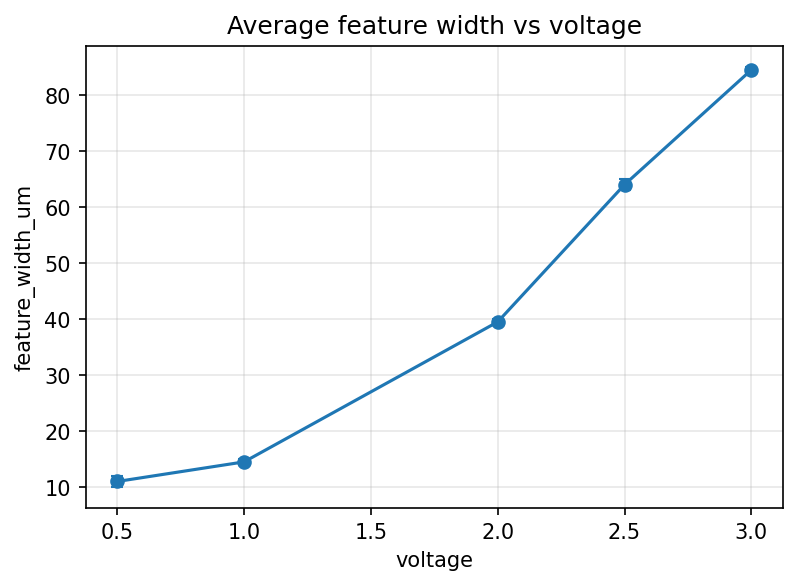

# Feature Width vs Voltage Analysis

This project analyzes feature width at different voltages from a CSV dataset.  
It computes group statistics (mean, count, SEM) and creates a plot with error bars.  

## 📊 Features
- Load CSV data into a pandas DataFrame  
- Group by voltage and calculate mean feature width  
- Compute standard error of the mean (SEM) for error bars  
- Generate and save plots with matplotlib  
- Automatically creates an `outputs/` folder for results  

## 🛠️ Tools & Libraries
- Python 3  
- pandas  
- numpy  
- matplotlib  
- pathlib  

## 📂 Repository Structure
```

📂 feature-width-analysis
│ 
├── README.md                           # Project overview
├── my_first_pandas.py                  # Main analysis script
├── sample.csv                          # Sample CSV files
└── voltage\_vs\_feature\_width.png     # Generated plots
````

## ▶️ How to Run
1. Clone this repository:
   ```bash
   git clone https://github.com/sakurachiwata/feature-width-analysis.git
   cd feature-width-analysis


2. Install required libraries:

   ```bash
   pip install -r requirements.txt
   ```

3. Place your CSV file in the `data/` folder. Example structure:

   ```csv
   voltage,feature_width_um
   1,12.3
   1,12.1
   2,13.4
   2,13.6
   ```

4. Run the script:

   ```bash
   python analysis.py
   ```

5. Check the `outputs/` folder for results:

   * `voltage_vs_feature_width.png`

## 📈 Example Output




---

## 📜 License

This project is licensed under the MIT License — see the [LICENSE](LICENSE) file for details.
